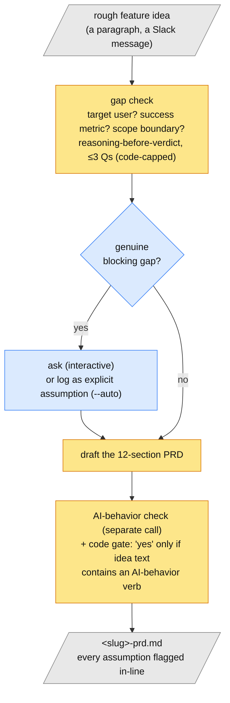
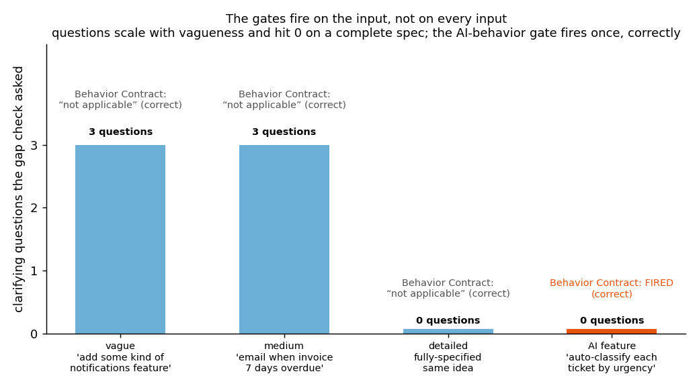

# PRD Generation Assistant

> Feed it a rough feature idea → it checks for genuinely blocking gaps, asks up to 3 clarifying
> questions *only if real gaps exist*, then drafts a structured PRD with every assumption
> explicitly flagged.

**TL;DR**
- **What it does** — turns a one-line idea into a reviewable first-draft PRD, without silently
  inventing the parts you didn't specify.
- **How the AI does the work** — a gap check runs *before* any drafting: it tests the idea
  against three things a PRD can't function without (target user, success metric, scope
  boundary) and only asks about a genuine blocker. Then a drafting call fills a deliberately
  designed 12-section structure. A separate call decides whether the feature needs an
  AI-behavior contract — and a code-level gate stops that call from firing on a false positive.
- **Ran on** — 4 test ideas: vague, medium, fully-specified, and one that genuinely involves AI
  behavior. Plus the same idea on a local model vs. Claude.
- **Headline result** — clarifying questions scale with vagueness (3 → 3 → 0 → 0) and hit zero
  on a complete spec, and the AI-behavior gate fires exactly once, correctly — because the
  judgment is a separate call, not something baked into the drafting prompt.
- **Try it** — open the repo in Claude Code and run `/aiprd <idea>` (no setup), or the Python
  CLI on local Ollama.

**Two ways to run the same method:**

- **As a Claude Code skill — no setup.** Clone, open in Claude Code, run `/aiprd <idea>` (or just
  ask for a PRD). Claude is the model — no Ollama, no Python, no API key.
- **As a Python CLI — scriptable / standalone.** Local [Ollama](https://ollama.com) (`llama3.2`)
  by default; `--backend claude` routes the same pipeline through the `claude` CLI.

The gap check → clarify → draft method, the 12-section structure, and the reasoning gates are
identical across both — shared prompt logic lives in [`prd_gen/prompts/`](prd_gen/prompts/). See
the parent [CLAUDE.md](../CLAUDE.md) and the sibling
[`ai-product-strategy-generator`](../3_ai-product-strategy-generator) (same pattern, applied to
strategy).

---

## The problem

Anyone can prompt an LLM into a confident-looking PRD. The failure mode is that it fills gaps
*silently* — it invents a target user, makes up a success metric, picks a scope boundary — so
the output reads as complete even though it's built on assumptions nobody chose. A reviewer then
either rubber-stamps invented scope or spends an hour reverse-engineering what the model assumed.

The actual skill isn't the prompt. It's knowing what a PRD cannot be missing, and building that
check into the tool so the gaps are *visible* — asked about when they're blocking, flagged as
explicit assumptions when they're not.

**You'd use this to** get a fast, structured first draft from a Slack-message-sized idea — one
where you can see exactly what it assumed before you trust a word of it.

## How it works

1. **Gap check** *(AI call + code cap)* — before any drafting, the model tests the idea against
   three things a PRD can't function without: *who it's for*, *how you'd know it worked*, *what's
   in vs. out of scope*. It's forced to write one sentence of reasoning per category *before*
   giving a verdict (see "What broke" #1). It asks a question only when a gap is genuinely
   blocking, capped at 3 — the cap enforced both in the prompt and in code.
2. **Clarify** *(interactive, or `--auto`)* — you answer the questions at the terminal, or skip
   them; unanswered questions become explicit entries in the PRD's "Assumptions I made" section,
   not silent choices.
3. **Draft** *(AI call)* — fills a 12-section structure designed on purpose, not copied from a
   generic template: Problem (with Working Hypothesis and Strategy Fit as separate one-line
   answers), a Behavior Contract, Success Measurement split into Offline Golden Set / Human
   Review / Online Metrics, a real Rollout Plan, Risk Management with a kill switch, and
   Ownership.
4. **AI-behavior check** *(separate AI call + code gate)* — decides whether the feature needs a
   Behavior Contract (GOOD/BAD/REJECT examples). The model's "yes" is only trusted if the idea
   text actually contains an AI-behavior verb (classify, generate, summarize, recommend…) — a
   check the model can't talk its way around (see "What broke" #2).



## What it ran on

**Inputs:** 4 test ideas plus a backend-comparison pair, all `--auto` runs. Full outputs in
[`examples/`](examples/):

| run | idea | why it's in the set |
|---|---|---|
| [vague.md](examples/vague.md) | "We should add some kind of notifications feature." | all 3 gaps blocking |
| [medium.md](examples/medium.md) | "Notify customers by email when their invoice is 7 days overdue…" | scope-edge gaps only |
| [detailed.md](examples/detailed.md) | fully-specified version of the same idea | **proves the gap check asks nothing when the input is complete** |
| [ai_feature.md](examples/ai_feature.md) | "…automatically classifies each new support ticket as Urgent / Normal / Low…" | proves the Behavior Contract fires in the "yes" direction |
| [edtech_app.md](examples/edtech_app.md) / [_claude.md](examples/edtech_app_claude.md) | same EdTech idea, `llama3.2` vs `claude-sonnet-4-5` | isolates pipeline vs. model |

**Known limitations of the setup:** the default runs use a ~3B local model whose drafting is
structurally sound but shallow, and which misreads directional details (see "What broke" #3).
The `claude` pair is checked in so the difference is visible.

## Results



*The gates respond to the input, not to every input. Clarifying questions scale with how
under-specified the idea is and drop to zero once the spec is complete; the AI-behavior gate
fires exactly once — on the ticket-classification idea — and correctly says "not applicable" for
the three non-AI features.*

**Backend comparison** (same idea, same pipeline, same gates — only the model differs; full
detail in the example files):

| | `llama3.2` (local) | `claude-sonnet-4-5` |
|---|---|---|
| Gap check questions | 2 thin ones (target user, success metric) | 2 that carry product weight (*which* success definition; MVP scope split) |
| Assumptions logged | 2 vague | 4 specific, each with *why that branch* and what would make it wrong |
| Behavior Contract examples | generic ("Physics" → "notes on Newton's laws") | encode calibration rules (difficulty can't skip a level; regulated domains rejected) |

The pipeline enforces the same structure and catches the same gaps either way. The model decides
whether the content *in* that structure is worth reading.

## What broke (and how I handled it)

1. **The gap check said "sufficient" for every input, including "add some kind of notifications
   feature."** The first version asked the model for a bare `{sufficient, questions}` verdict —
   it wasn't reasoning about the gaps at all, just defaulting to the easy answer. **Fix (in
   code + prompt):** force one sentence of reasoning per category *before* the verdict.
   Re-running the vague input then correctly produced three real questions.
2. **The AI-behavior check failed in both directions, then fabricated evidence.** Attempt 1
   asked the drafting model to decide inline, mid-document — it marked a feature literally
   described as "automatically classifies tickets" as "not applicable" (the same skipped-reasoning
   failure as #1, inside a bigger prompt). Attempt 2 moved it to its own JSON call — that fixed
   the false negative, but on an unrelated notifications idea the model said "true" and justified
   it by *quoting a phrase that doesn't appear anywhere in the idea*. **Fix that shipped (code
   gate):** a "true" verdict is only accepted if the idea text itself contains one of a fixed
   list of AI-behavior verb stems. Disclosed ceiling: a genuine AI feature described in unusual
   words could be missed — a safer failure than a fabricated false positive.
3. **The drafter inverts directional details.** In the current `detailed.md`, the model wrote
   "notifications are sent 7 days *before* an invoice is due" — the actual ask was 7 days
   *after* it becomes overdue. **Not fixed — disclosed:** this recurs across regenerations, so
   it's a real small-model drafting limitation, not a one-off. The real (inverted) output is
   left in place rather than swapped for a cleaner run — quietly picking a better regeneration
   is exactly what this project's Tradeoffs discipline exists to prevent.

## Design decisions (Tradeoffs)

Required per [CLAUDE.md](./CLAUDE.md):

1. **PRD structure deliberately differs from a generic template.** (a) Goals and Non-Goals are
   *one* section — a non-goal only makes sense against a goal, and splitting them loses the
   contrast. (b) No Timeline or Stakeholders sections — that's project-tracking metadata that
   goes stale in a doc that's supposed to be authoritative. (c) "Assumptions I made" sits right
   after Requirements, not at the end — scope assumptions need to be seen *where scope is
   defined*, not after a reviewer's attention has moved on.
2. **Only "blocking" gaps trigger a question, capped at 3, one per category.** Everything else
   becomes a stated assumption. The cap is enforced twice (prompt + `pipeline.py: MAX_QUESTIONS`,
   hard-sliced) because a prompt-only cap isn't reliable with a small local model. Three matches
   the three category checks; more turns idea-capture into an interrogation a PM would abandon.
3. **The gap check forces per-category reasoning before each verdict** (see "What broke" #1) —
   a disclosed limitation of small local models: without an explicit reasoning step they don't
   reliably do the judgment at all.
4. **The AI-behavior check is its own call, and its "true" is gated in code** (see "What broke"
   #2).
5. **The 12-section structure is heavier than a minimal PRD, sourced from a published AI-PRD
   framework** (Behavior Contract, Rollout Plan, Risk Management, Ownership) rather than
   invented. Cost: longer, slower output — a launch-track feature needs Rollout and Risk
   sections; a one-line internal note doesn't need all twelve.
6. **The tool still hands the LLM the first full draft** — in tension with the source framework's
   own advice ("LLM as copilot, not ghostwriter"). Naming the tension rather than hiding it:
   what this produces is what that framework calls a *speclet* — a rough first pass meant to be
   revised, with every gap flagged, not a finished PRD.
7. **The backend is switchable but the two JSON judgment calls lose `temperature=0` on the
   `claude` CLI backend** (the CLI exposes no temperature knob). Hasn't flipped a verdict across
   runs tested — the fixed JSON schema constrains them — but it's a real reason to prefer the
   API over the CLI if run-to-run reproducibility matters.

## Where not to trust it

- **The small local model inverts directional details** ("before" vs "after", "over" vs
  "under"). Read the Requirements section against your original ask. `--backend claude` doesn't
  do this.
- **The AI-behavior gate can miss a genuine AI feature described in unusual language** — the
  code gate is deliberately conservative.
- **A generated speclet is not a PRD.** It still needs a human pass on Strategy Fit, the real
  behavior contract for a launch, and rollout risk tolerance.

**Before circulating a generated PRD, you'd** rewrite the Problem and Strategy Fit in your own
words, check every "Assumptions I made" bullet, and confirm the directional details survived.

## Try it yourself

**Claude Code skill (no setup):** clone, open in Claude Code, run `/aiprd <idea>` or just ask
for a PRD. It runs the gap check interactively (say "just draft it" to skip), then writes
`<slug>-prd.md`.

**Python CLI:**

```bash
ollama pull llama3.2               # default local backend
pip install -r requirements.txt

python3 -m prd_gen.cli generate --idea "your feature idea here"
python3 -m prd_gen.cli generate --idea "..." --auto             # skip Q&A; gaps become assumptions
python3 -m prd_gen.cli generate --idea "..." --backend claude   # through the claude CLI
python3 scripts/make_charts.py                                  # refresh the results chart
```

## Takeaways

- **If you build with AI:** any judgment you need from a model ("is this complete", "does this
  apply") is more reliable as a small dedicated call with reasoning forced *before* the verdict
  — and if the judgment is load-bearing, back it with a deterministic code check the model can't
  argue around. A bare verdict from a small model is often just the agreeable answer.
- **If you're making the product call:** an AI-drafted PRD's value is entirely in whether you
  can *see what it assumed*. A doc with no visible assumptions isn't complete — it's hiding
  them. This tool's whole design is making those visible.
- **If you're just curious:** an LLM can give you a structured PRD from one sentence in under a
  minute — but the useful version is the one that stops and asks, or tells you plainly what it
  had to guess.

---

*Part of a portfolio of small, real AI projects — see the
[profile](https://github.com/ridhikagoel). I write these up in more depth in my newsletter,
**AI Explained Better**.*
